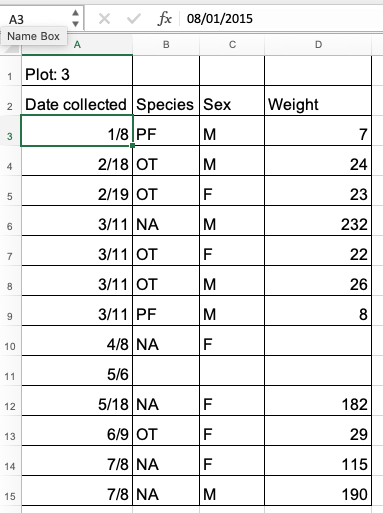
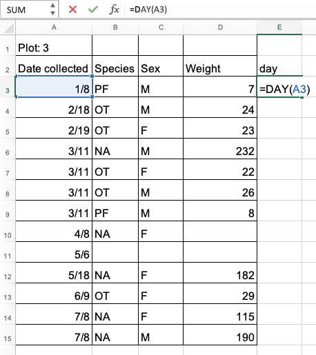
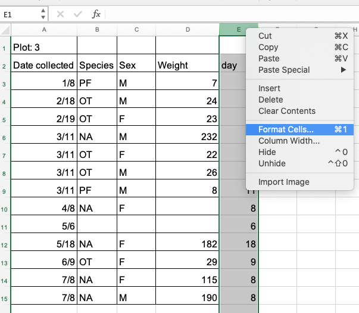
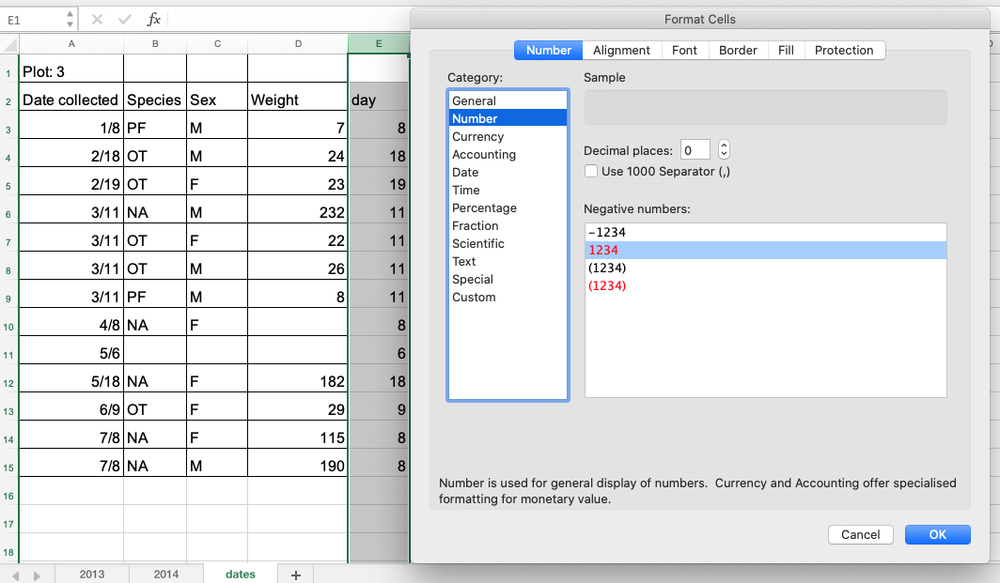
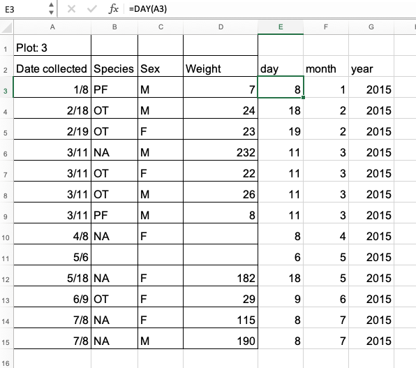

Dates in spreadsheets are often stored in a single column. While this seems like a logical way to record dates when 
you are entering them, or visually reviewing data, it may not actually be the best practice when preparing data 
for analysis.

When working with data, the goal is to have as little ambiguity as possible. Ambiguity can creep into your data 
when working with dates when there are regional variations either in your observations and when you or your team might 
be working with different versions or suites of software products (e.g., LibreOffice, Microsoft Excel, Gnumeric). Also,
spreadsheet programmes can be quite forgiving and let you be lazy and not enter the year (which the program then 
interpolates as the current year). Such useful features can introduce ambiguity and errors in your data. 

One of the other reasons dates can be tricky is that most spreadsheet programs have other useful features which can change 
the way dates are displayed - but not stored. The image below demonstrates some of the many date formatting options in Excel.

From the above figure you can see that there are many ways that ambiguity can creep into your data depending 
on the format you chose when you enter your data, and if you are not
fully aware of which format you are or people before you were using, 
you can end up actually entering your data in a way that Excel will badly misinterpret and 
you will end up with errors in your data that will be extremely difficult to track down and troubleshoot. 

When working with dates it is also important to remember that functions are guaranteed to be compatible only within 
the same family of software products (e.g. LibreOffice, Microsoft Excel, Gnumeric). 
If you need to export your data and conserve the timestamps, you are better off handling dates using 
one of the solutions discussed below than the single column method.

Additionally, Excel can [turn things that are not dates into dates](https://nsaunders.wordpress.com/2012/10/22/gene-name-errors-and-excel-lessons-not-learned/), 
for example names or identifiers like MAR1, DEC1, OCT4. Recently, scientists had to 
[rename human genes to stop 
Microsoft Excel from misreading them as dates](https://www.theverge.com/2020/8/6/21355674/human-genes-rename-microsoft-excel-misreading-dates), as it was estimated that 20% genetics research papers contained errors! So, avoiding the built-in date format overall 
may help you avoid such issues. 

To avoid ambiguity between regional differences in date formatting and compatibility across spreadsheet 
software programs or when exporting data to text based formats such as comma-separated values (CSV), 
a good practice is to divide dates into components in different columns - day, month, and year. You will learn how to 
do this and other alternatives for storing dates below.

## Dates stored as integers

The first thing you need to know is that Excel internally stores dates as numbers - see the last column in the above figure. 
This serial number represents the number of days from 31 December 1899. So, 1 January 1900 is stored as number 1, 2 January 1900
is stored as number 2, and so on. In the example above, 2 July 2014 is stored as 
the serial number 41822 as this is the number of days that elapsed since December 31, 1899.

> ## Excel's date systems on Macs
> Excel also entertains a second date system, the 1904 date system, as the default in Excel for Mac. 
> This system will assign a
> different serial number than the 
> [1900 date system](https://support.microsoft.com/en-us/help/214330/differences-between-the-1900-and-the-1904-date-system-in-excel). 
> Because of this,
> [dates must be checked for accuracy when exporting data from Excel](http://datapub.cdlib.org/2014/04/10/abandon-all-hope-ye-who-enter-dates-in-excel/) between Macs and PCs (look for dates that are ~4 years off).
{: .callout}

This serial number thing can actually be useful in some circumstances. By using
the certain built-in date functions we can easily add days, months or years to a given date.
Say you had a research plan where you needed to conduct interviews with a
set of informants or sample your data every ninety days for a year.

In our example above, in a new cell you can  type:
    
    =B2+90
    
And Excel would return:

    30-Sep

because it understands the date as a number `41822`, and `41822 + 90 = 41912`
which Excel interprets as the 30 September 2014. In most cases, it 
retains the format of the cell that is being operated upon. Month and year rollovers are internally tracked and applied.

> ## Note on adding and subtracting dates and times 
> Adding months and years to a date is slightly trickier than adding days because we need to make
> sure that we are adding the amount to the correct entity (i.e. month or year). To do so,
>
> - first we need to extract single entities (day, month or year) from the date (how to do that is explained in one of the exercises below),
> - then, we can add values to each entity (e.g. month or year),
> - finally, we need to reconstruct the date from the updated day, month, year entities using the `DATE()` function.  
>
> Times are handled in a similar way; seconds can be directly
> added but to add hours and minutes we need to make sure that we are adding
> the quantities to the correct entities. Extracting seconds, minutes and hours from a time is explained
> in one of the exercises below.
{: .callout}

## Regional date formatting
When you enter a date into a spreadsheet it looks like a date although the spreadsheet program may
display different text from what you input. It does this to be 'helpful' but it often is not. 
For example if you enter '7/12/88' into your
Excel spreadsheet it may display as '07/12/1988' (depending on your version of Excel). These
are different ways of formatting the same date.

Different countries also write dates differently. If you are in the UK, for example, you will interpret
the date above as the 7th of December, however a researcher from the US will interpret the same entry as the 
12th of July. This regional variation is handled automatically by your
spreadsheet program so that when you are typing in dates they appear as you would expect. If you
try to type in a US format date into a UK version of Excel, it may or may not be treated as a
date (i.e. it may not be detected as a date at all by a UK version of Excel and may be left as a string). This is
especially bad when you have a mix of correct dates and dates Excel cannot parse in the same column, effectively 
mixing in two different data types for your data (strings and dates).

> ## Exercise
>   
> Look at the tab 'dates' in the [messy data spreadsheet](data/messy_survey_data.xls) you used in previous exercises. 
> It contains the copy the 'plot 3' table from the '2014' tab (this is the table that contains the problematic dates). 
> You will notice that there are years missing from the "Date collected" column. Just by looking at the entered dates, 
> can you figure out the date format that was used?
>
> > ## Solution
> > The date format is 'MM/DD/YYYY' because we have entries like '2/19' and '5/18', which means that the person who 
> > entered these dates most probably used the US version of Excel where month comes before day. If we did not have such 
> > entries, we would not be able to tell what date was entered! For example, is '7/11' '7th November' or '11th July'?  
> {: .solution}
{: .challenge}

## Default year

If no year is specified, the spreadsheet program will assume you mean the current year 
and will insert that value. This may be incorrect if you are working with historical data so
be very cautious when working with data that does not have a year specified within its date
variable.

> ## Exercise
>   
> Look at the tab 'dates' in the [messy data spreadsheet](data/messy_survey_data.xls). 
> It contains the copy the 'plot 3' table from the '2014' tab (this is the table that contains the problematic dates). 
> Select one of the cells in "Date collected" column, for example cell 'A3'. What is the date Excel thinks is 
> entered? What is the year of the date? 
>
> > ## Solution
> > Select any cell in "Date collected" column. In the field for the cell formula at the top, 
> > Excel will display the value that is stored 
> > internally for this cell.
> >      
> > From the cell that is selected in the figure above, we can see that Excel has stored the date "08/01/2015" 
> > (i.e. 8 January 2015 using the DD/MM/YYYY format).
> > You can see that even though we expected the year to be 2014 (this was data for year 2014), 
> > the year is actually 2015. 
> >
> > What happened here is 
> > that the field assistant who collected the data for year 2014 initially forgot to put their data for 'plot 3' 
> > in this dataset. They came back in 2015 to add the missing data into the dataset and entered the dates for 'plot 3' 
> > without the year. Excel automatically interpreted the year as 2015 - the year the data was entered into the 
> > spreadsheet and not the year the data was collected. Thereby, errors were introduced in the 
> > dataset without the field assistant realising.
> {: .solution}
{: .challenge}

> ## Exercise  
> What happens to the dates in the `dates` tab of the messy spreadsheet if we export this sheet to `.csv` 
>(Comma--Separated Value format) and then open the file in a plain text editor (like TextEdit or Notepad)? 
> What happens to the dates if we then open the `.csv` file back in Excel?
> > ## Solution
> > 1. Click to the `dates` tab of the [messy data spreadsheet](data/messy_survey_data.xls).   
> > 2. Select `File -> Save As` in Excel and in the drop down menu for file format select `CSV UTF-8 (Comma delimited) (.csv)`. 
> > Write a file name to save to, e.g. `dates-export.csv`. Click `Save`.  
> > 3. You will see a pop-up that says "This workbook cannot be saved in the selected file 
> > format because it contains multiple sheets." Choose `Save Active Sheet` or `OK` depending on your Excel version. 
> > 4. Make sure you close your current messy data spreadsheet for now too (you can reopen it later). This is because 
> > Excel may treat the exported CSV file as the tab of the current (messy) workbook which is what we do not want.   
> > 5. Navigate to the `dates-export.csv` file (or whatever you named it) in your file system. Right click and select `Open With`. 
> > Choose a plain text editor application and view the file. Notice that the dates display as month/day without any year information.   
> > 6. Now right click on the file again and open with Excel. Notice that the dates display with the current year, not 2015.   
> > As you can see, exporting data from Excel and then importing it back into Excel fundamentally changed the data once again!  
> {: .solution}
{: .challenge}

> ## Note on exporting  
Some versions of Excel, when exporting into a text-based format (such as CSV), will export its internal date integer 
representation of the date instead of the date's value. This can potentially lead to problems if you use other software 
to manipulate the data as they may not understand Excel's date encodings.
{: .callout}

## Historical data
Excel is unable to parse dates from before 1899-12-31, and will thus leave these untouched.  If you are 
mixing historic data
from before and after this date, Excel will translate only the post-1900 dates into its internal format, thus 
resulting in mixed data. If you are working with historic data, be extremely careful with your dates!

## Preferred date formats
Entering dates in one cell is helpful but due to the fact that the spreadsheet programs may interpret and 
save the data in different ways (doing that somewhat behind the scenes). Regional data variations and missing 
years are also good reasons not to treat date as a single data point. Separating dates into their component parts
will avoid this confusion, while also giving the added benefit of allowing you to compare, for
example data collected in January of multiple years with data collected in February of multiple years.

Let's have a look at some good options for storing dates.

### Storing dates as YEAR, MONTH, DAY
As previously mentioned, storing dates in YEAR, MONTH, DAY format is one good alternative for storing dates 
and eliminates any chance of ambiguity.

For instance, this is a spreadsheet representing insect counts that were taken every few days over the summer, 
and things went something like this:

Now, according to Excel, this person had been collecting bugs in the future!

> ## Exercise
>
> Challenge: pulling month, day and year out of dates. 
>   
> 1. Look at the tab 'dates' in our messy data spreadsheet. Extract month, day and year from the dates in the 
> "Date collected" column into three new columns called 
> 'month', 'day', 'year'. To do so, you can 
> use the following built-in Excel functions:
>
>     `YEAR()`  
>     `MONTH()`  
>     `DAY()`  
> 2. Apply the formulas on each of the row of table 'plot 3' in the 'dates' tab. To do so, drag the formula for the 
> first row down to the last row.
> 3. Make sure the new columns are formatted as a number and not as a date. 
>
> > ## Solution 
> > 1. Create column 'day' for the first row of the table (note that this is not 
> > the first row of the spreadsheet) and insert formula `=DAY(A3)` in cell E3. 
> > This applies the function `DAY()` on the value in cell A3, which is the date 
> > of the first observation. 
> > 2. Drag this formula to the last row of the table - 
> > you will see the formulas and calculations for the month appearing in the cells below. 
> >   
> > 3. To format the
> > column 'day' as a whole number, right click on the column 'E' (for 'day') and select `Formal cells...` option.
> >       
> > Select 'Number' and set decimal places to 0. 
> >       
> > Repeat the same process for month and year. You should end up with a table like the one below.
> >   
> > Again, as in the previous exercise but this time using the `YEAR()` function, 
> > we can see that Excel saved the year for data as 2015 (the year the data is entered) instead of 2014 (the 
> > year the data was collected). This was entirely the mistake of the field assistant but by being helpful
> > Excel managed to "mask" this error.
> {: .solution}
{: .challenge}

As for dates, times are handled in a similar way and there are functions to extract hours, minutes and seconds.

> ## (Optional) Exercise 
> 
> Challenge: pulling hour, minute and second out of the current time.
>
> Current time and date are best retrieved using the functions `NOW()`, which
> returns the current date and time, and `TODAY()`, which returns the current
> date. The results will be formatted according to your computer's settings.
> 
> 1. Extract the year, month and day from the current date and time string
> returned by the `NOW()` function.  
> 2. Calculate the current time using `NOW()-TODAY()`.   
> 3. Extract the hour, minute and second from the current time using
> functions `HOUR()`, `MINUTE()` and `SECOND()`.  
> 4. Press `F9` to force the spreadsheet to recalculate the `NOW()` function,
> and check that it has been updated.  
> 
> > ## Solution
> > 1. To get the year, type `=YEAR(NOW())` into any cell in your spreadsheet. To get the month, type `=MONTH(NOW())`. To get the day, type `=DAY(NOW())`.  
> > 2. Typing `=NOW()-TODAY()` will result in a decimal value that is not easily human parsable to a clock-based time.  
> > You will need to use the strategies in the third part of this challenge to convert this decimal value to 
> > readable time.  
> > 3. To extract the hour, type `=HOUR(NOW()-TODAY())` and similarly for minute and second.  
> {: .solution}
{: .challenge}

###  Storing dates as YEAR, DAY-OF-YEAR

Storing dates as year and day-of-year (DOY) is another good alternative for storing dates. Depending on your
research question, this format may be what is useful to you, and there is practically no possibility for ambiguity creeping in.

Statistical models often incorporate year as a factor, or a categorical variable, rather than a numeric variable, 
to account for year-to-year variation, and DOY can be used to measure the passage of time within a year. 

So, how can you convert all your dates into DOY format? For Excel, here is a useful guide:

###  Storing dates as a single string

Another alternative could be to convert the date string
into a single string using the `YYYYMMDDhhmmss` format.
For example the date `March 24, 2015 17:25:35` would
become `20150324172535`, where:

YYYY:   the full year, i.e. 2015  
MM:     the month, i.e. 03  
DD:     the day of month, i.e. 24  
hh:     hour of day, i.e. 17  
mm:     minutes, i.e. 25  
ss:     seconds, i.e. 35  

Such strings will be correctly sorted in ascending or descending order, and by
knowing the format they can then be correctly parsed by the receiving data analysis
software. Make sure your column containing such data is formatted as 'text'.
